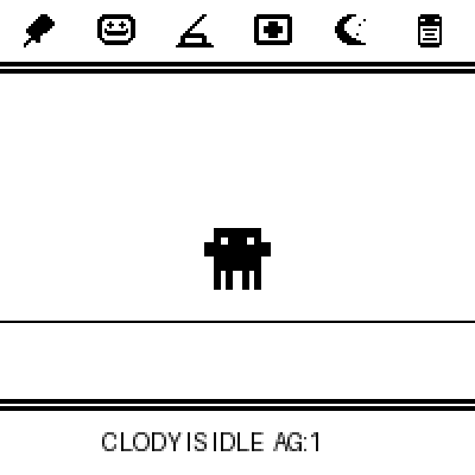
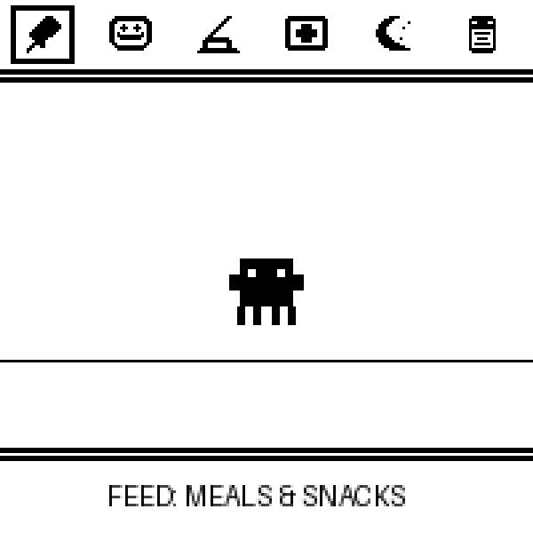
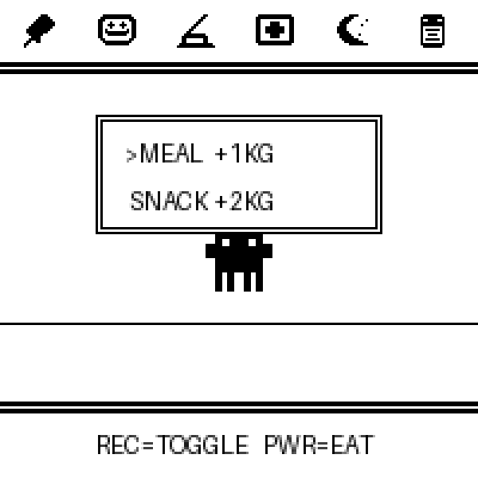
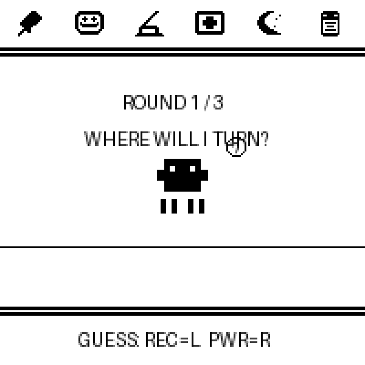
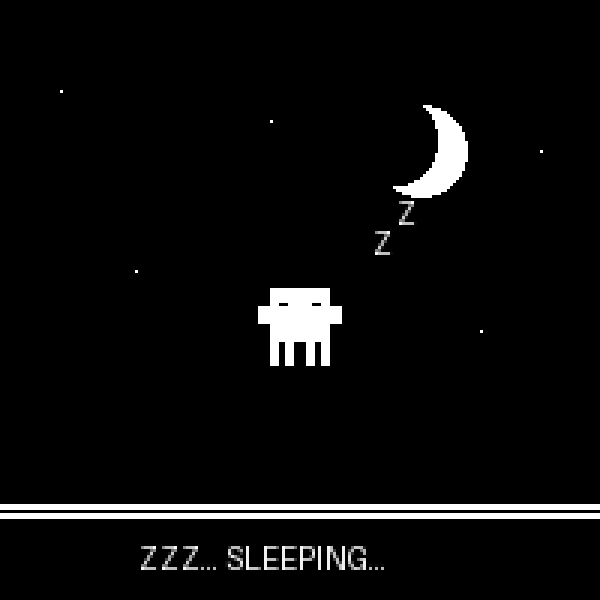
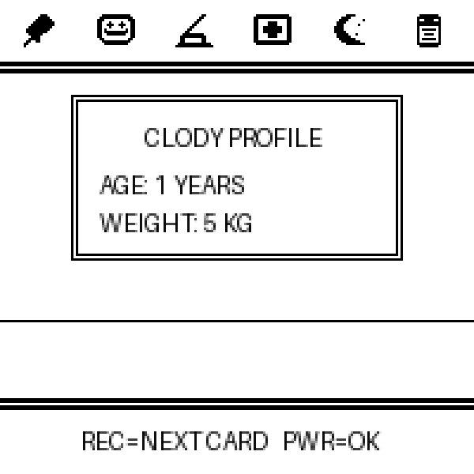
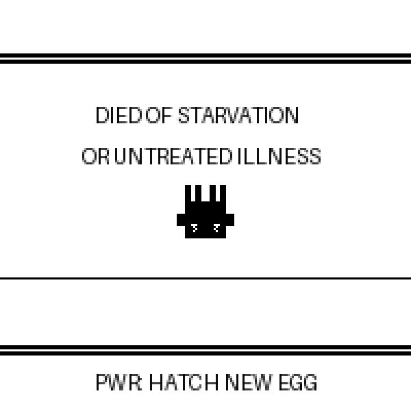

# Clody - Retro E-Paper Companion 🤖

A complete, self-contained, low-power retro virtual pet game designed specifically for the **Waveshare ESP32-S3 1.54 inch E-Paper board** (200x200 1-bit monochrome display, powered by ESP32-S3).

Clody is inspired by the cute, 8-bit retro space-invader style mascot of **Claude Code**, bringing a responsive and lively companion directly to your desktop or pocket!

Clody is optimized for the dual-button constraints of the Waveshare ESP32-S3 1.54 inch E-Paper board, using debounced inputs, partial screen refreshes to eliminate annoying e-paper full-screen flashing, and low-level canvas drawing APIs to keep dependencies minimal (no heavy library like `Adafruit_GFX` needed!). It also integrates the onboard ES8311 audio codec for fun synthetic chimes, sounds, and musical scores!

---

## 📸 Screen Gallery

| 01. Idle Home Screen | 02. Action Menu |
|:---:|:---:|
|  |  |

| 03. Feeding Sub-menu | 04. Guessing Game |
|:---:|:---:|
|  |  |

| 05. Sleeping (Paused) | 06. Character Profile |
|:---:|:---:|
|  |  |

| 07. Death Screen |
|:---:|
|  |

---

## 🎮 How to Play

### Physical Controls
The Waveshare ESP32-S3 1.54 inch E-Paper board has exactly **two physical buttons**:
*   **Button 1 (GPIO 0, labeled "REC")**: **SELECT / NEXT** — Cycles through menu options, statistics screens, or options in a game.
*   **Button 2 (GPIO 18, labeled "PWR")**: **CONFIRM / ENTER** — Activates an action, confirms a choice, or opens the stats panel directly from the idle screen.

### Game States & Interactions
1.  **Idle State**:
    *   Clody breathes, bounces, and moves on the screen.
    *   **Press BTN 1**: Enter the Action Menu.
    *   **Press BTN 2**: Quick-check Clody's stats (Age, Hunger, Happiness, Weight, Sick status, etc.).
2.  **Action Menu**:
    *   A beautifully clean, looping 6-icon menu across the top bar: **Feed 🍖, Play 🎮, Clean 🧹, Heal 💊, Sleep 🌙, Stats 📊**.
    *   No clumsy "Exit" item! When you reach the right side of the menu, it smoothly loops back to the left.
    *   **Press BTN 1**: Move to the next menu icon.
    *   **Press BTN 2**: Confirm/Enter the highlighted action.
3.  **Feed 🍖**:
    *   Select between a **Meal** (increases fullness, adds weight) or **Snack** (increases happiness, adds weight, high risk of sickness).
    *   **Press BTN 1**: Toggle between Meal and Snack.
    *   **Press BTN 2**: Confirm feeding (plays eating animations and chewing sounds).
4.  **Play (Guessing Game) 🎮**:
    *   A 3-round guessing game where you predict which direction Clody will look (**LEFT ⬅️** or **RIGHT ➡️**).
    *   **Press BTN 1**: Toggle your guess (Left or Right).
    *   **Press BTN 2**: Lock in guess. Clody will look in a randomized direction. If you guessed right, you win the round!
    *   Winning at least 2 out of 3 rounds significantly increases happiness and drops weight.
5.  **Clean 🧹**:
    *   If Clody poops, a soft-serve poop pile icon appears next to it. Sickness risk increases with more poops!
    *   Selecting **Clean** plays a broom-sweeping animation and brushing chimes, clearing the poop.
6.  **Heal 💊**:
    *   If Clody is sick, a skull flasher appears, and its eyes turn into sad diagonal slits. Sickness decays health rapidly and can lead to death.
    *   Selecting **Heal** administers a syringe animation, curing the sickness with success chimes.
7.  **Sleep 🌙**:
    *   Turns the lights OFF. Stars and a crescent moon appear.
    *   While sleeping, Clody's stats do **not** decay, allowing you to pause the game safely when you are sleeping or away.
    *   **Press BTN 1 or 2**: Turns the lights back ON and wakes Clody.
8.  **Stats Profile 📊**:
    *   Cycles through multiple stats screens:
        *   **Age & Weight**: Displays current age in days, and weight in kg.
        *   **Hunger Hearts**: Displays 4 hearts indicating fullness.
        *   **Happiness Hearts**: Displays 4 hearts indicating happiness.
    *   **Press BTN 1**: Cycle to the next stats card.
    *   **Press BTN 2**: Return to Idle screen.
9.  **Death/RIP 🪦**:
    *   If hunger or happiness drops to 0, or if sickness is neglected too long, Clody will pass away. A vertically inverted mascot with classic "X X" dead eyes appears.
    *   **Press BTN 2**: Hatch a new egg to start a brand new journey!

---

## 🛠️ Arduino IDE Compilation Settings

To compile and upload this project to your Waveshare ESP32-S3 1.54 inch E-Paper board:

1.  Open **Arduino IDE**.
2.  Go to `File` -> `Preferences` and ensure you have the ESP32 board manager URL added:
    `https://raw.githubusercontent.com/espressif/arduino-esp32/gh-pages/package_esp32_dev_index.json`
3.  Go to `Tools` -> `Board` -> `ESP32` and select:
    **`ESP32S3 Dev Module`**
4.  Configure the following settings under **Tools**:
    *   **USB CDC On Boot**: `Enabled` *(Crucial for serial monitor logs and debugging)*
    *   **Flash Size**: `8MB (64Mb)`
    *   **Partition Scheme**: `Default 8MB with app partition of 3MB` or `Huge APP (3MB No OTA)`
    *   **PSRAM**: `OPI PSRAM` *(Required for memory layout)*
5.  Select your board's COM/Serial Port under **Tools** -> **Port**.
6.  Click **Upload** (Arrow icon) to compile and flash the board!

---

## 💻 USB Serial Terminal Interface (Interactive Overrides)

Since Clody supports active logging and USB CDC-on-Boot debugging, you can interact with your virtual companion directly through any USB Serial Monitor (such as the Arduino IDE Serial Monitor, CoolTerm, or PySerial) configured at **115200 baud**. 

This allows you to force states, monitor decays, and manually change the room's weather:

*   `weather sunny` (or `weather sun`): Instantly shift the weather to a sunny sky with rotating beams, save it to Flash, and trigger a partial refresh.
*   `weather rainy` (or `weather rain`): Instantly shift the weather to dense clouds and sliding diagonal raindrops.
*   `weather snowy` (or `weather snow`): Instantly shift the weather to winter clouds and drifting snowflake crosses.
*   `weather`: Query the currently active weather status on the device.

---

## 📁 Project Structure

*   `clode.ino`: Main game engine, game loop, custom drawing functions, state machine, and pixel asset definitions.
*   `config.h`: Central hardware pin mappings (SPI, I2C, Power latch, Buttons, battery ADC).
*   `sounds.h`: UI and sound-effect synthesizer utilizing the onboard ES8311.
*   `src/`: Board-level hardware support files:
    *   `src/display/`: Low-level e-paper driver, partial-update routines, SPI communication.
    *   `src/power/`: Battery monitor, voltage latch, power management rails.
    *   `src/audio/` & `src/codec_board/` & `src/esp_codec_dev/` & `src/i2c_bsp/`: ES8311 codec driver, I2S sound writer, I2C bus config.

---

## ⚙️ Design & Architecture Highlights

*   **Partial Refreshes (EPD_DisplayPart)**: Standard e-paper displays require a slow (~2-3 seconds) full-screen black/white strobe flash to refresh. To prevent this, we initialize the display in **Partial Refresh mode**. Animations update in under **0.3 seconds** with no flickering, making the game feel responsive.
*   **Mirror-X Proportional Drawing**: Since memory is premium, we created a proportional horizontal flip logic (`mirrorX` flag) for the pet drawing routine. A single 32x32 pixel pet bitmap can face both **Left** and **Right** dynamically, cutting asset storage requirements in half!
*   **Inactivity Timeout**: If left unattended in a menu or stats card, the system automatically sounds a brief exit chime and returns to the idle screen after 15 seconds, preventing the display from staying stuck in a sub-menu.
*   **Lights-Out Pause State**: The sleep function acts as a smart pause mechanism. Turning off the lights suspends stat decay so Clody won't starve while you work or sleep.
*   **Persistent NVS Flash Saves**: Enabled through ESP32 non-volatile storage (`Preferences.h`). Major companion life moments (aging, decays, eating, playing, clearing poop, curing sickness) automatically save all pet statistics (Age, Weight, Hunger, Happiness, Sick status, Poop, and Weather) to the onboard flash. When rebooted, Clody resumes *exactly* where you left off, protecting your progress! To prevent flash wear, writes are strictly bounded to events and decay intervals, avoiding high-frequency wear.
*   **Dynamic Animated Weather System**: Centered above the floor is an interactive 4-pane cozy cottage window rendering dynamic, animated weather backdrops synced with the 1.5s visual heartbeat tick:
    *   **Sunny Days**: Features a cute rotating retro sun frame sending cozy dotted/solid solar rays streaming into the room.
    *   **Rainy Days**: Renders sliding diagonal raindrops falling under fluffy rain-cloud outlines.
    *   **Snowy Days**: Displays floating, drifting pixel-star snow crosses drifting from fluffy winter clouds.
*   **Natural Climate Transitions & USB Serial Control**: Weather naturally cycles over time (35% chance every 45-minute stat decay), and Clody's status bar updates dynamically to alternate between standard idle text and adorable climate-specific dialogue. For showcasing or custom desktop automation, you can type commands like `weather sunny`, `weather rainy`, or `weather snowy` in any USB Serial Monitor to instantly shift the weather, save it to NVS, and trigger a partial screen update!
